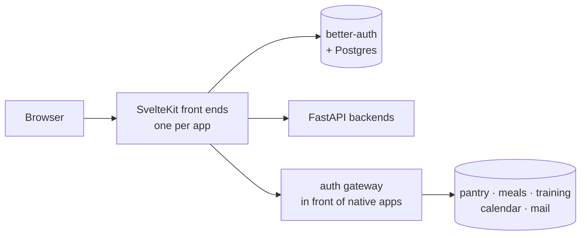

# saganta

The front half of the [Saganta Suite](https://github.com/sami-djouhri/saganta-suite):
the shell you sign into, the apps that live in it, and the backends behind them.
All user-facing text is German.

## Shape

Two kinds of app, and they behave differently when you deploy them:

- **Its own front end** under `apps/<name>`, with a FastAPI backend under
  `services/<name>-api`. News, notes, projects, diary, mail view.
- **An auth gateway** (`apps/app-proxy`) in front of a native service that lives
  in its own repository. Pantry, meals, training. There is no `apps/<name>`
  here; changing that surface means changing the other project.

Sign-in is [better-auth](https://better-auth.com) with a Postgres store. Front
ends stamp short-lived tokens for their backends with a shared secret; the
backends verify with the same one.

## The diary is the odd one out, on purpose

Three things about `apps/tagebuch` differ from every other app here, and all
three are decisions rather than omissions:

**End-to-end encrypted in the browser.** The server holds ciphertext and wrapped
keys and nothing else. That rules out server-side search and rules out any
language model reading it, which is the trade being made deliberately.

**No egress.** `tagebuch-api` sits alone on an internal network and cannot reach
anything outside it. This matters more than it sounds: the main internal network
here is *not* `internal`, and a service on it can reach the open internet. A
future bug in a service that cannot open a socket sends nothing anywhere.

**WebCrypto needs a secure context.** Over plain `http://host:port` the browser
does not provide `crypto.subtle`, and the failure surfaces as something that
looks like a wrong passphrase. Reach it over HTTPS, including a self-signed
authority, and it works.

## Two things worth knowing

**Emptying a default means finding who consumes it.** Removing a hard-coded
fallback here would have left `trustedOrigins` with a bare scheme as an entry and
a cross-subdomain cookie scoped to the empty string, which no browser accepts.
Both would have failed silently at runtime, not at startup.

**A single-file bind mount decouples the inode.** After editing a mounted
configuration file, the syntax check inside the container validates the *old*
file and reports success. Only recreating the container attaches the new one.

## License

AGPL-3.0. If you run this as a service for other people, publish your changes.

If that does not work for you, a commercial licence is available: write to
<sami@djouhri.de>. Contributions require the rights grant in `CONTRIBUTING.md`,
which is what keeps that option open.

## About this snapshot

The recipe, not the data. The secrets vault, the certificate of an in-house
authority, the deploy script for one particular machine and the operating notes
are not in here.

The development history stays private; the public one starts at the first
release and grows with each one.
